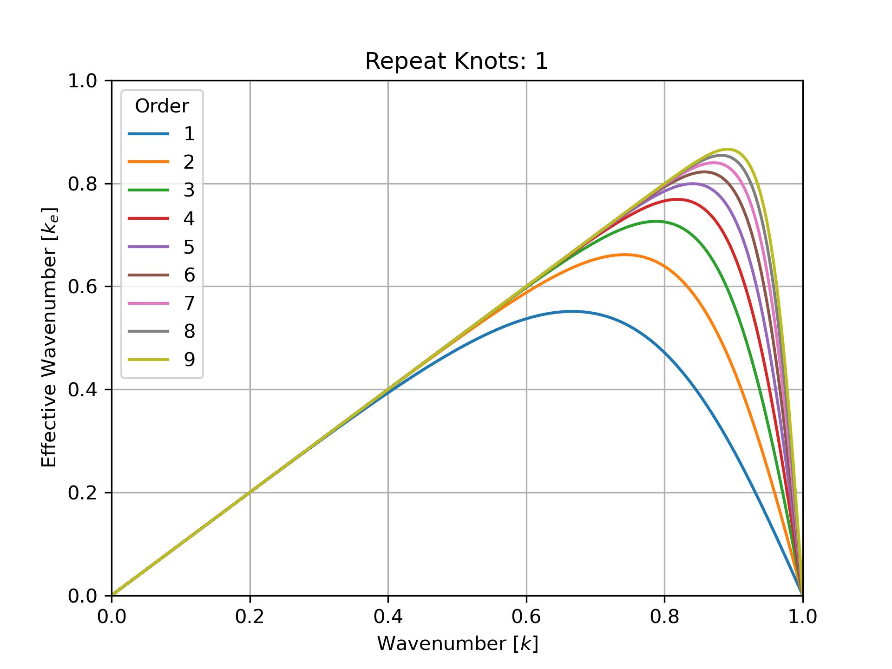

  
 
    
  

  

    
 <b>Joshua Bigman, PhD Student</b>  
        <em>Advisor: Robert Moser</em>

    
 <a href="https://oden.utexas.edu" target="blank">Oden Institute for Computational Engineering and Sciences</a> 
    <a href="https://utexas.edu" target="blank">The University of Texas at Austin</a> 
    <a href="https://pecos.oden.utexas.edu" target="blank">Predictive Engineering and Computational Science</a>

  

 

I am a PhD student at the Oden Institute for Computational Engineering and Sciences at UT Austin with an anticipated graduation year of 2027. I am currently investigating numerical dispersion in B-Splines with my advisor Robert Moser. I previously received my Bachelor's in Mechanical Engineering and Physics with a Minor in Mathematics from Northeastern University.

My research interests include computational fluid dynamics and multi-physics modeling.
